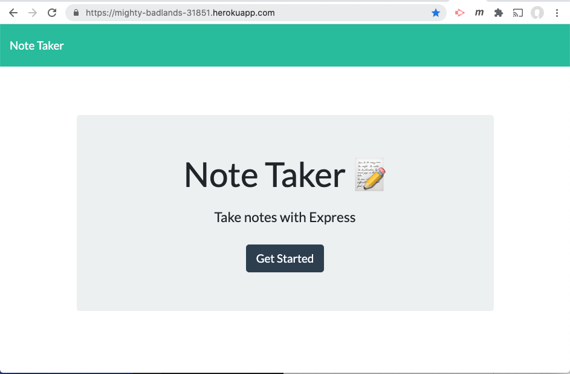
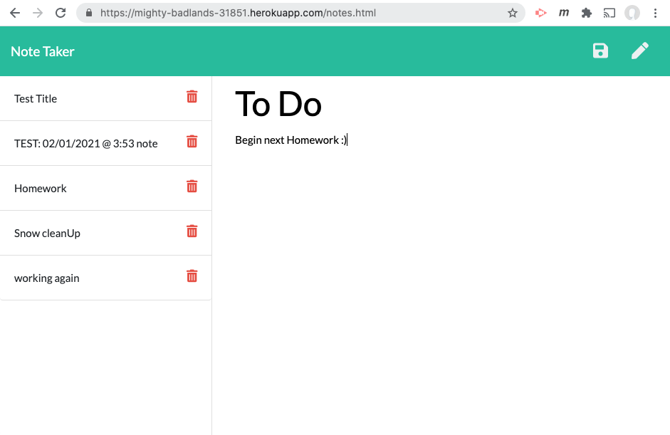
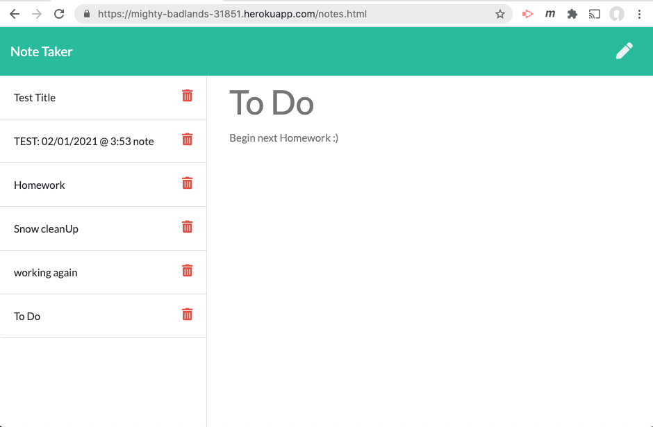
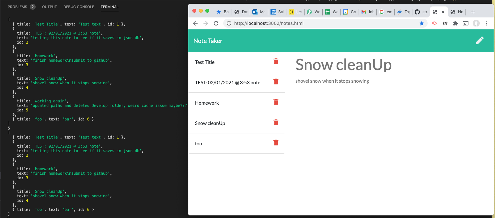

  # Project Title: HW #11 Note Taker (using Express)
    
  ## Table of Contents:
  - [Project Description](#project-description)
  - [Installation Instructions](#installation-instructions)
  - [Project Usage Information](#project-usage-information)
  - [Contribution Guidelines](#contribution-guidelines)
  - [Testing Instructions](#testing-instructions)
  - [License Type](#license-type)
  - [Github Repo Link](#github-repo-link)
  - [HEROKU Application Live Link](#github-live-web-link)
  - [Github Information](#github-information)
  - [my-email-for-questions-and-information](#my-email-for-questions-and-information)

  - - -
  ## Screenshot of App running on Heroku, click Get Started to run:
  

  - - -
  ## Screenshot of App running on Heroku, showing the current notes stored, and adding a new note to store after clicking the save icon:
  

  - - -
  ## Screenshot of App running on Heroku, shows the new note stored along with the previous stored notes:
  

    - - -
  ## Screenshot of App running on localhost, showing JSON storage object:
  

  &nbsp;
  - - -
  ## Project Description:
  - This is a basic note taking application.  When the app is started, you are taken to a page where you are able to add and delete your notes.  Each note can have a title and will persist in memory on the server in a "database-like" json object. 

  &nbsp;
  - - -
  ## Installation Instructions:
  - To install this appication locally, you will need node & express that you can install with >npm install command.  Once installed, simply rung  the following at the terminal command prompt >node ntServer.js  -  The application will then begin.  The application is also deployed on Heroku at the following link: https://mighty-badlands-31851.herokuapp.com/notes.html   -  where you can just enter in your browers address bar and begin to use the note taking app.  

  &nbsp;
  - - -
  ## Project Usage Information:
  - This application stores your user input.  The data collected persists in a json object that is saved on a heroku server.  Any data you enter can be deleted per your request.  If the application is being run locally on your machine, the same data object and delete options are available.  Please do not enter any sensative information as there is no security or encryption on this data.  This application is for non-business application and for personal use only.  The data entered can be seen by anyone who has access to this application.  There is no password protection accessing this application.

  &nbsp;
  - - -
  ## Contribution Guidelines:
  - I made this, PAC with Streaming Turtles, LLC.

  &nbsp;
  - - -
  ## Testing Instructions:
  - The application does not have any unit testing, but if you are running the application locally (on your localhost:3002 using port 3002) you can see the stored date in the terminalin a JSON object format.  Although this is not a test, it can serve as confidance that your data is being saved into some type of storage.  The storage is not locally persistant in the browsers cache, but locally in a file on your computer or on the heroku server via the deployed Application.

  &nbsp;
  - - -
  ## License Type:
  - 

  &nbsp;
  - - -
  ## gitHub Repo Link:
  - https://github.com/streamingTurtles/11-Note-Taker

  &nbsp;
  - - -
  ## Heroku Live Application Link:
  - https://mighty-badlands-31851.herokuapp.com/

  &nbsp;
  - - -
  ## Github Information:

  
- user name: streamingTurtles
- [GitHub Profile](https://github.com/streamingTurtles)

  ## my-email-for-questions-and-information:
  - pcardillo@streamingTurtles.com  

  &nbsp;
- - -
- - -
Peter Cardillo, Columbia Engineering Fullstack Bootcamp, 2020-2021  
